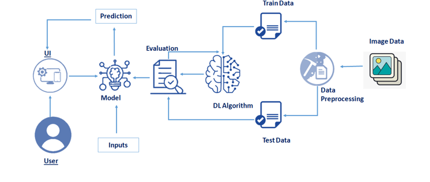

# IBM-Project-7543-1658888377
### A Novel Method for Handwritten Digit Recognition System
## Category: Artificial Intelligence
## Skills Required:
### Python,CNN,IBM Cloud,IBM Watson Studio,IBM Cloudant DB,Deep Learning,Python-Flask

### Team ID: PNT2022TMID01999
#### Team members:

|Name|Roles|
|---|---|
|MUTHU AKILESH K | Leader|
|VINU GAUTAM M | Member|
|RATHEESH VARMAN S P | Member|
|NITHYA PRAVIN R V | Member|

-----

Project Description:

Handwriting recognition is one of the compelling research works going on because every individual in this world has their own style of writing. It is the capability of the computer to identify and understand handwritten digits or characters automatically. Because of the progress in the field of science and technology, everything is being digitalized to reduce human effort. Hence, there comes a need for handwritten digit recognition in many real-time applications. MNIST data set is widely used for this recognition process and it has 70000 handwritten digits. We use Artificial neural networks to train these images and build a deep learning model. Web application is created where the user can upload an image of a handwritten digit. this image is analyzed by the model and the detected result is returned on to UI

